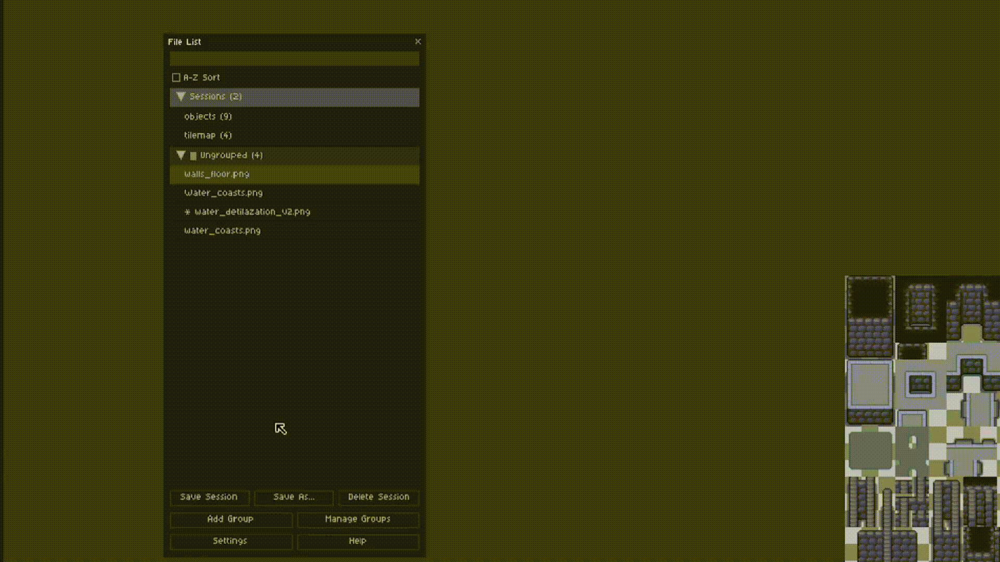
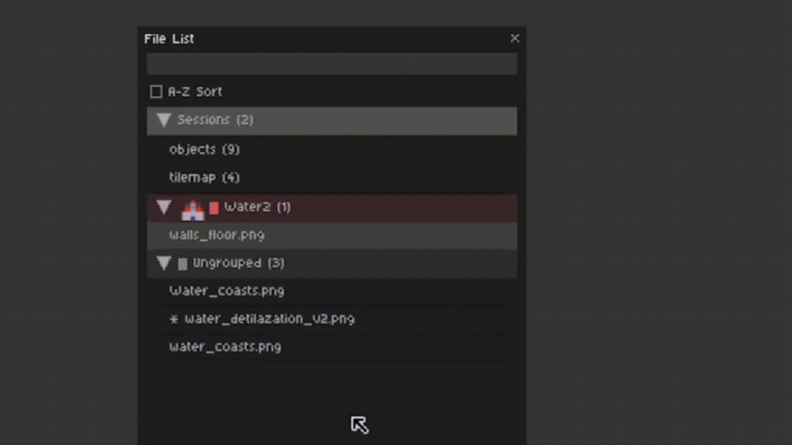
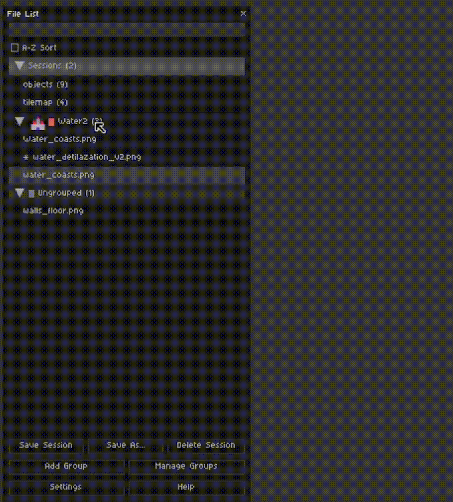
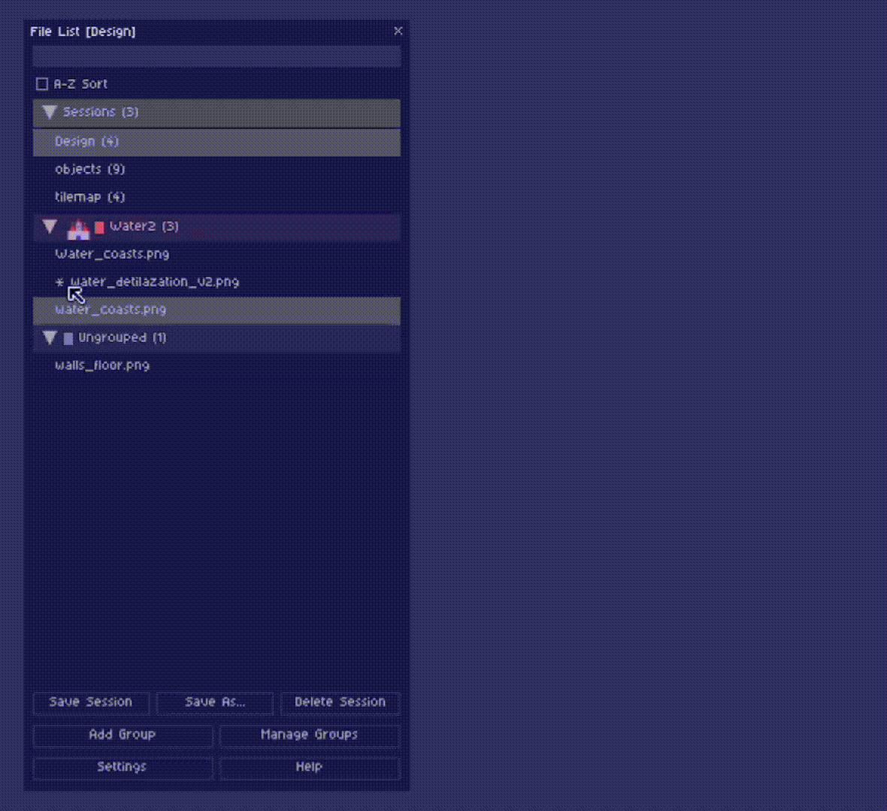
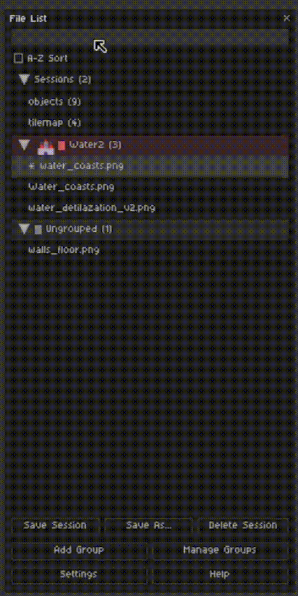
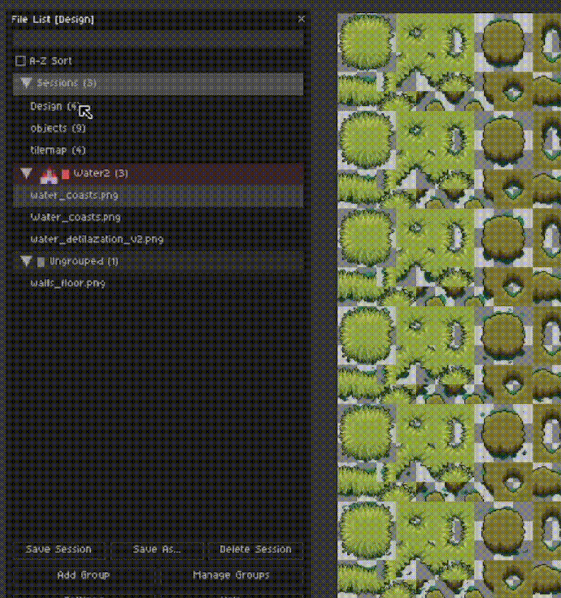

https://softwhiskey.itch.io/aseprite-advanced-tabs
Advanced Tabs for Aseprite​​​​​​​​

Tired of juggling dozens of tabs in Aseprite? Are your complex projects turning into a chaotic mess of files? Stop fighting your tools and start creating.

Advanced Tabs is the professional project navigator you've been missing. It's a powerful, dockable side panel that replaces the standard file tabs with a feature-rich vertical list, completely transforming how you manage your projects.
Powerful Organization

Stay focused by organizing your sprites into logical, collapsible groups. Create, edit, and assign files with simple clicks.

Quickly move files between groups or switch your active sprite with ease. The vertical layout makes it effortless to see everything at a glance.

​
Full Session Management

Save your entire workspace—all open files and their group arrangements—as a named session. Perfect for switching between multiple projects without losing your place.

​​​
Instantly switch between complex projects. Loading a session automatically closes unneeded files and opens everything you need, exactly where you left it.

​​
Streamlined Workflow

Find the exact file you need in seconds, no matter how large your project is, with the built-in live search bar.

​​
Customize the panel's appearance to fit your needs by adjusting line height and other visual settings.

​​
And when it's time to clean up, you can safely and permanently delete old sessions.

​​
❗ Requirements

ATTENTION: This extension uses a small external script to safely handle deleting session files, which prevents data corruption caused by limitations in Aseprite's scripting environment.

    Aseprite v1.3+ (tested on 1.3.15)

    Python 3.x is required for session deleting and must be installed on your system and accessible from your command line. (Most macOS and Linux systems have it pre-installed. Windows users can download it from the official Python website.)

Support & Feedback

Found a bug or have an idea for a new feature? Join the official Discord server to report issues and share your suggestions. I'd love to hear your feedback and will consider all feasible ideas for future updates.

Join the Discord Server for Support